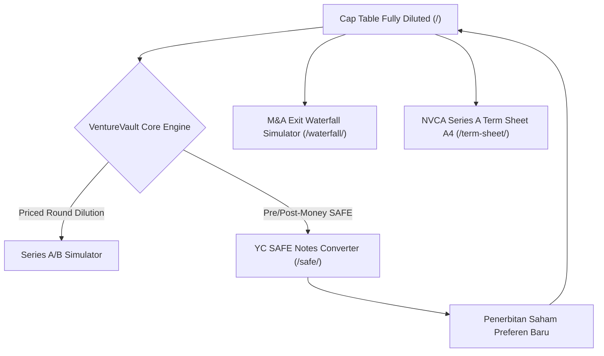

# 🏛️ VentureVault OS — Private Equity & VC Cap Table Modeling Engine
### Titan #13 of the 50 Sovereign Enterprise Fleet (`olyxmintabansos-byte`)

---

## 💎 Overview
**VentureVault OS** adalah platform sistem operasi permodalan ventura (*Venture Capital*) dan ekuitas privat (*Private Equity*) kelas institusional dengan arsitektur *client-side local-first*. Platform ini menyediakan **Buku Besar Kepemilikan Saham (Cap Table Fully Diluted)**, **Mesin Konversi YC SAFE Notes**, **Simulator Air Terjun Preferensi Likuidasi M&A (Liquidation Preference Waterfall Engine)**, serta **Generator Term Sheet Seri A Standar NVCA Berformat Cetak A4**.

---

## 🚀 Fitur Unggulan (4 Rute 100% Live)

1. **Cap Table Equity Matrix (`/`)**:
   - Buku besar kepemilikan saham fully diluted (Founders Common, Seed Preferred, ESOP Option Pool).
   - Visualisasi multi-segment stacked equity bar.
   - Simulator putaran pendanaan baru (Series A/B) yang secara otomatis menghitung dilusi saham dan harga per lembar (*implied share price*).
2. **SAFE Notes Conversion Engine (`/safe/`)**:
   - Formula konversi instrumen YC Post-Money SAFE: `min(Valuation Cap Price, Discount Price)`.
   - Konversi 1-klik yang otomatis menerbitkan saham preferen baru ke dalam Cap Table.
3. **M&A Exit Liquidation Preference Waterfall (`/waterfall/`)**:
   - Simulator pembagian hasil penjualan M&A/IPO dari $5M hingga $200M.
   - Perhitungan hak preferensi 1x Non-Participating Preferred, titik konversi (*conversion threshold*), dan Multiple on Invested Capital (MOIC).
4. **NVCA Series A Term Sheet Generator (`/term-sheet/`)**:
   - Lembar kesepakatan investasi modal ventura standar National Venture Capital Association (NVCA).
   - Format cetak A4 pixel-perfect (`window.print()`) lengkap dengan klausul tata kelola dewan direksi, hak protektif investor, dan blok tanda tangan legal.

---

## 🏗️ Diagram Arsitektur Sistem

---

## 🌐 Rute Live Produksi
- **Cap Table Matrix:** [https://olyxmintabansos-byte.github.io/venturevault-os/](https://olyxmintabansos-byte.github.io/venturevault-os/)
- **SAFE Notes Converter:** [https://olyxmintabansos-byte.github.io/venturevault-os/safe/](https://olyxmintabansos-byte.github.io/venturevault-os/safe/)
- **M&A Waterfall Simulator:** [https://olyxmintabansos-byte.github.io/venturevault-os/waterfall/](https://olyxmintabansos-byte.github.io/venturevault-os/waterfall/)
- **NVCA Term Sheet A4:** [https://olyxmintabansos-byte.github.io/venturevault-os/term-sheet/](https://olyxmintabansos-byte.github.io/venturevault-os/term-sheet/)

---

*Architected by Antigravity Chief Systems Architect • Executed by Hermes Agent Desktop • Sovereign Fleet for `olyxmintabansos-byte`*
